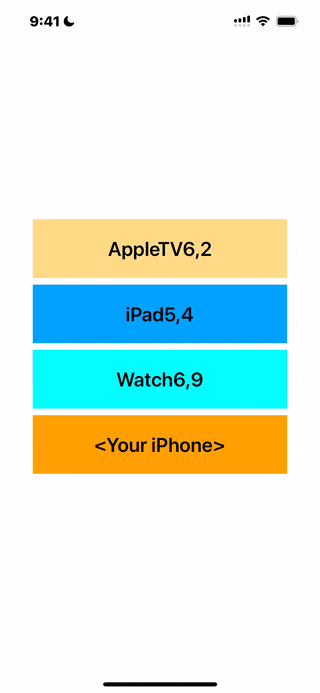

# WWDetectDevice
[](https://developer.apple.com/swift/) [](https://developer.apple.com/swift/)  [](https://developer.apple.com/swift/) [](https://developer.apple.com/swift/)

### [Introduction - 簡介](https://swiftpackageindex.com/William-Weng)
- [Detect the device name and other related information from the device number.](https://www.theiphonewiki.com/wiki/Models)
- [由裝置編號檢測該裝置的名稱等相關資訊。](https://iosref.com/)



### [Installation with Swift Package Manager](https://medium.com/彼得潘的-swift-ios-app-開發問題解答集/使用-spm-安裝第三方套件-xcode-11-新功能-2c4ffcf85b4b)

```bash
dependencies: [
    .package(url: "https://github.com/William-Weng/WWDetectDevice.git", .upToNextMajor(from: "1.1.0"))
]
```

### Function - 可用函式
|函式|功能|
|-|-|
|deviceModelObject(type:)|取得該裝置類型的全文件資料 (iPad / iPhone / AppleTV / AppleWatch)|
|deviceModel(type:)|取得該裝置類型的全文件字典 (iPad / iPhone / AppleTV / AppleWatch)|
|deviceInformation(type:identifier:)|取得該單一裝置類型的資訊 (iPad / iPhone / AppleTV / AppleWatch)|
|deviceInformation(identifier:)|取得該單一裝置類型的資訊|
|parseDeviceType(identifier:)|依照裝置Id去解析DeviceType|

### Example
```swift
import UIKit
import WWPrint
import WWDetectDevice

final class ViewController: UIViewController {

    private typealias Info = (type: DeviceType, identifier: String)
        
    private let infos: [Info] = [
        (type: .AppleTV, identifier: "AppleTV6,2"),
        (type: .iPad, identifier: "iPad5,4"),
        (type: .AppleWatch, identifier: "Watch6,9"),
        (type: .iPhone, identifier: UIDevice._identifier()),
    ]
    
    override func viewDidLoad() {
        super.viewDidLoad()
        
        let info = WWDetectDevice.shared.deviceInformation(identifier: "iPad13,11")
        wwPrint(info)
    }
    
    @IBAction func detectDevice(_ sender: UIButton) {
        
        guard let information = infos[safe: sender.tag] else { return }
        
        let info = WWDetectDevice.shared.deviceInformation(type: information.type, identifier: information.identifier)
        sender.setTitle(info["name"] as? String, for: .normal)
    }
}
```
