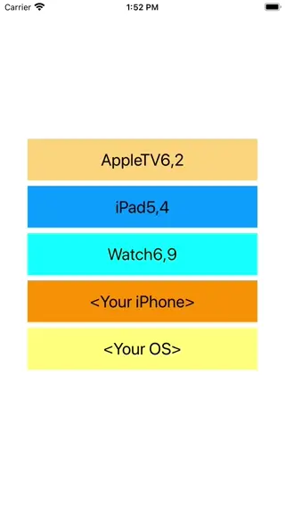

# WWDetectDevice
[](https://developer.apple.com/swift/) [](https://developer.apple.com/swift/)  [](https://developer.apple.com/swift/) [](https://developer.apple.com/swift/)

### [Introduction - 簡介](https://swiftpackageindex.com/William-Weng)
- [Detect the device name and other related information from the device number.](https://www.theiphonewiki.com/wiki/Models)
- [由裝置編號檢測該裝置的名稱等相關資訊。](https://iosref.com/)



### [Installation with Swift Package Manager](https://medium.com/彼得潘的-swift-ios-app-開發問題解答集/使用-spm-安裝第三方套件-xcode-11-新功能-2c4ffcf85b4b)

```bash
dependencies: [
    .package(url: "https://github.com/William-Weng/WWDetectDevice.git", .upToNextMajor(from: "1.3.0"))
]
```

### Function - 可用函式
|[函式](https://everymac.com/ultimate-mac-lookup/?search_keywords=iPhone16,1)|[功能](https://useyourloaf.com/blog/iphone-16-screen-sizes/)|
|-|-|
|deviceModelObject(type:)|取得該裝置類型的全文件資料 (iPad / iPhone / AppleTV / AppleWatch)|
|deviceModel(type:)|取得該裝置類型的全文件字典 (iPad / iPhone / AppleTV / AppleWatch)|
|deviceIdentifier()|取得該裝置的內部編號 (實機才可以)|
|deviceInformation(identifier:)|取得該單一裝置類型的資訊|
|deviceSystemInformation()|取得系統的相關資訊|

### Example
```swift
import UIKit
import WWPrint
import WWDetectDevice

final class ViewController: UIViewController {

    private typealias Info = (type: WWDetectDevice.Constant.DeviceType, identifier: String)
    
    private let identifiers: [String] = [
        "AppleTV6,2",
        "iPad5,4",
        "Watch6,9",
        WWDetectDevice.shared.deviceIdentifier(),
    ]
    
    @IBAction func detectDevice(_ sender: UIButton) {
        
        guard let identifier = identifiers[safe: sender.tag],
              let name = WWDetectDevice.shared.deviceInformation(identifier: identifier)["name"] as? String
        else {
            return
        }
        
        sender.setTitle(name, for: .normal)
        printType(identifier: identifier)
    }
    
    @IBAction func detectOS(_ sender: UIButton) {
        let os = "\(WWDetectDevice.shared.deviceSystemInformation().name) \(WWDetectDevice.shared.deviceSystemInformation().version)"
        sender.setTitle(os, for: .normal)
    }
    
    private func printType(identifier: String) {
        
        if identifier.contains("iPhone") {
            let type = WWDetectDevice.Constant.iPhoneType.find(with: identifier)
            wwPrint(type); return
        }
                
        if identifier.contains("iPad") {
            let type = WWDetectDevice.Constant.iPadType.find(with: identifier)
            wwPrint(type); return
        }
        
        if identifier.contains("Watch") {
            let type = WWDetectDevice.Constant.AppleWatchType.find(with: identifier)
            wwPrint(type); return
        }
        
        if identifier.contains("AppleTV") {
            let type = WWDetectDevice.Constant.AppleTVType.find(with: identifier)
            wwPrint(type); return
        }
    }
}
```
